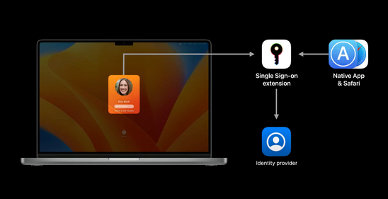

Apple's WWDC 2022 gave us quite some tings to have in mind going through the year. Both with macOS 13 (Ventura) and iOS and iPadOS 16.  
Let's have a look and see what delicious features they are providing, some might have the potential to be disruptive, some might not.   

## Let's start with hardware limitations for macOS Ventura

Sometimes when a new OS drops, some hardware adoptions might be needed due to security features it provides. Ventura will drop support for a quite hefty portion of hardware compared to other versions.

You will need a device no older than 2017. For MacBook Air and Mini, push it to 2018. Mac Pro users, you need the cheesegrater. Time to throw my own trashbin in the... trashbin.

The list is the following: 
>
> - MacBook 2017 and later 
> - MacBook Pro 2017 and later 
> - iMac 2017 and later 
> - iMac Pro 2017 
> - MacBook Air 2018 and later 
> - Mac Mini 2018 and later 
> - Mac Pro 2019 and later 

 

## Platform Single Sign-On

With this update, Apple will release Platform Single Sign-On. This allows the user to utilize, in example, their Azure AD or company account to unlock their devices. This will automatically keep the device's local account password in synd with the cloud password. Which will result in a more seamless sign-on experience.

The best part is, we can create config profiles for this! I really hope Microsoft will dish this one out quite fast for their Company Portal! They have given a timeline of this fall.

||
|:--:|
|Apple Platform Single Sign-on

## Gatekeeper

Gatekeeper will do a bit of a switcharoo in macOS Ventura, instead of checking the code at first run as it does today. It will include checking notarized apps if they have been altered/modified after the initial launch by unathorized processes. Apple has stated that *some* processes are allowed, but those processes has to be allowed by the developer.

This boils down to apps with autoupdaters, etc. Check your apps!

Altough, with these amazing news, the Gatekeeper check is overridable by users. I'll give it a try to see if these settings will be modifiable by admins.

## Passkeys

A collaboration with Google, Microsoft, and other big players on the field, they have been working on a technology for web and remote services which they call 'Passkeys'. This is an aim to solve problems with passwords in general. 

It's essentially a public-private key encryption.
One key is stored (securely) on the device, and the other key in the cloud/server. Each passkey is generated for a single account. We don't need to remember the passwords, and the device will automatically let the user to choose the available passkey when trying to log on to a service. You can then use FaceID or TouchID to verify the ownership and login.

Passkeys will be stored in, for Apple users, the iCloud Keychain. So as long as you have access to a device with your iCloud account logged on, and synced with Keychain, you should be good to go.

## Login Items, LaunchAgents and LaunchDaemons

With the rehaul of the 'System Preferences' application, it's now 'System Settings', and it's quite similar to the iOS/iPadOS format (or, it's a copy). 

From a security standpoint, some features that's nice is the ability to now manage Login Items, LaunchAgens and LaunchDaemons from a single place in System Settings. Previously we had to use the Terminal, jump into hidden folders in Finder or use 3rd Party Softwares. This can give us a great benefit to actually pull data and see if some applications silently add persistence items without authorization from the user.

While these are good tools for administrators. For a user to go in here and turn of a bunch of launchers might not be that optimal since enterprises might use applications with dependencies that's required for critical systems. So let us hold out thumbs that we can lock this down a bit!

## So all in all...

A lot of the new features are very welcomed and let us hope they give us even more tools to work with in an enterprise environment (looking at you Software Updates...)